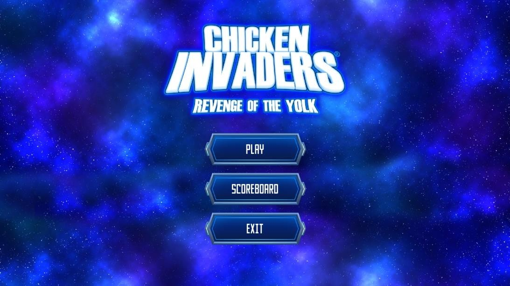
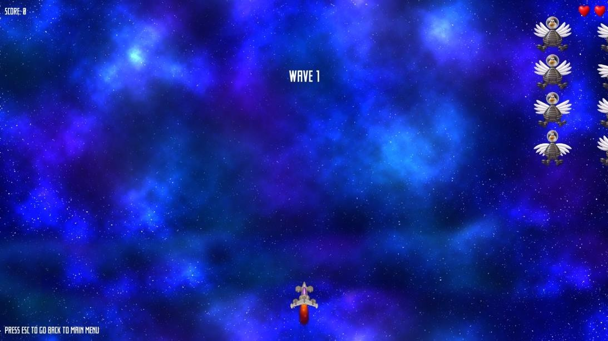
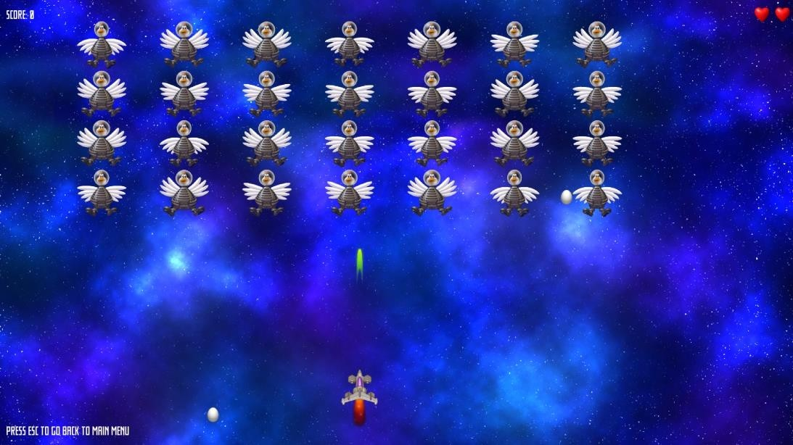
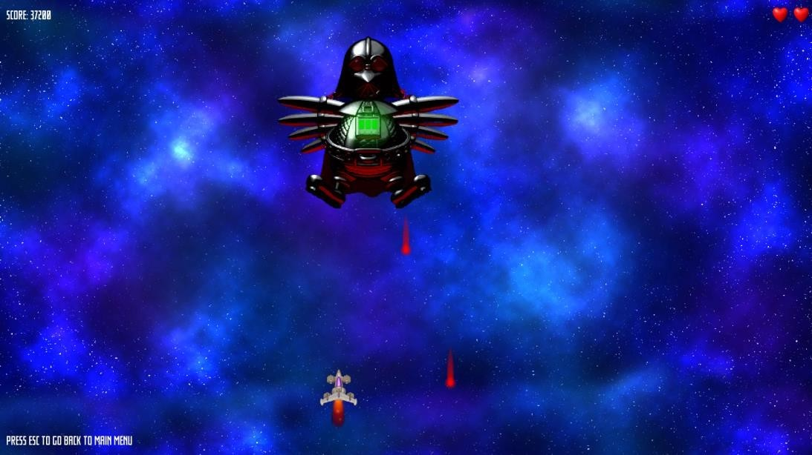

# Chicken Invaders — Revenge of the Yolk

Arkadna *space shooter* igra napravljena u Pythonu uz biblioteku **pygame**, kao projektni
zadatak iz predmeta **CS324**.

Igrač upravlja svemirskim brodom na dnu ekrana i brani se od talasa svemirskih kokošaka.
Posle tri očišćena talasa sledi borba sa bosom.



## Kako se igra

| Taster | Akcija |
| --- | --- |
| `W` `A` `S` `D` | Kretanje broda |
| `Space` | Pucanje (cooldown 0.3 s) |
| `Esc` | Povratak u glavni meni |

- Počinješ sa **3 života**. Pogodak od jajeta ili sudar sa kokoškom oduzima jedan.
- Pogodak kokoške nosi **100** poena, obaranje dodatnih **550**.
- Oborene kokoške ispuštaju **batake** — pokupi ih za još **550** poena.
- Igra ima **4 talasa**: tri talasa kokošaka i finalni boss.
- Najboljih 5 rezultata čuva se u `scores.csv` i prikazuje na *Hall of Fame* ekranu.

## Slike iz igre

| | |
| --- | --- |
|  |  |
|  | |

## Pokretanje

Potreban je **Python 3.10+** i pygame.

```bash
git clone https://github.com/MilicaGolub/CS324-Projektni-zadatak.git
cd CS324-Projektni-zadatak
pip install pygame
python main.py
```

Igra se pokreće u **fullscreen** režimu.

> **Napomena:** projekat koristi `ctypes.windll` za isključivanje DPI skaliranja,
> pa radi samo na **Windowsu**.

## Struktura projekta

```
main.py           — ulazna tačka, inicijalizuje pygame i pokreće igru
game_setup.py     — glavna petlja, talasi, kolizije, meniji
player.py         — igračev brod, kretanje, pucanje, animacija uništenja
enemy.py          — kokoške, boss, batak i perje
projectile.py     — zajednička klasa za lasere i jaja
scoreboard.py     — čuvanje i prikaz rezultata (CSV)
ui.py             — dugmad i elementi korisničkog interfejsa
util/             — konstante, učitavanje slika i zvukova
assets/           — grafika, zvuk i font
```

## Autor

Milica Golubović — Univerzitet Metropolitan, CS324
